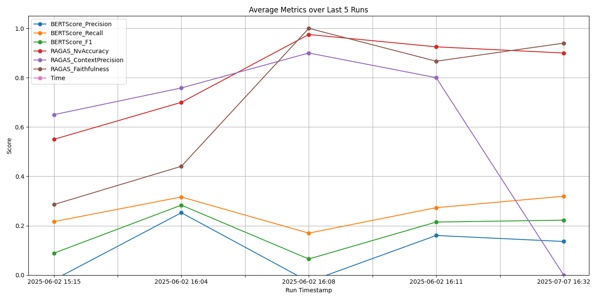

# Master Thesis RAG



## Thesis outline

Literature Review:

What is RAG? Why is it useful for this task? What similiar research has been done in similiar domains? What prior evaluations have been done?

I don't plan to go very low level about RAG technical details since it should not be relevant for the evaluation and discussion, but not sure about this.

Methodology:

Describing the codebase, maybe frontend as well not sure about this one

Evaluation:

Describing the evaluation framework, e.g. automated testing, graphs, evaluation metrics, QA

Results:

Showing the results, showing influence of different parameters, models etc., listing outliers/special findings

Discussion:

Making sense of the results, discussing them in relevancy to the museum usecase, comparing to previously mentioned similiar research from literature review, highlighting remaining weaknesses for further research

## Timeframe

Weeks that might have unplanned work from the previous one are marked with an (!) since I am not sure about the time/scope requirement for these, I have planned enough buffer weeks at the end to accomodate for this.

[10.6 - 17.6]

Finishing framework (e.g. GPT)

Continue with Literature Review

[17.6 - 24.6]

Finish Literature Review

[24.6 - 1.7] (!)

Start with Methodology

[1.7 - 8.7]

Continue with Methodology

[8.7 - 15.7]

Gather Data and take relevant notes and start Evaluation chapter

[15.7 - 22.7]

Gather remaining Data if needed and finish Evaluation chapter

[22.7 - 29.7] (!)

Start Results chapter

[29.7 - 5.8]

Develop frontend, finish Results

[5.8 - 12.8]

Finish frontend

[12.8 - 19.8] (!)

Discussion chapter

[19.8 - 26.8]

Finish Discussion if needed, start Conclusion, Introduction, Abstract

[26.8 - 2.9]

Conclusion, Introduction, Abstract

[2.9 - 27.9]

Thesis should be finished by now, remaining time is buffer and for finalising

[23.9 - 27.9]

Hand-in during this week

## Sprint 1

Added initital vertex base generation and retrieval logic with langchain, huggingface and FAISS.
Retrieved text is just plain extraction and not adjusted for LLM usage.

Chunking is currently simple with a fixed character amount and some overlap.

---

Added LLM integration with Ollama. Currently only via code and not in a conversation. Utilizing RetriavalQA from langchain as RAG pipeline.

---

Added continuous chatting with LLM and refactored single query into seperate function.

Currently, it sometimes answers in english and answers too rigid based on the PDF. E.g. a query that has no connection to the PDF like "Antworte nur in Deutsch" does not really work. ConversationBufferMemory seems to be deprecated so changing that might help.

## Comments from Daksitha
- instead of  ConversationBufferMemory maybe you could give a try 
    ````memory = ConversationBufferWindowMemory(
            k=10,  # number of conversation turns (or messages) to keep
            memory_key="chat_history",
            return_messages=True
        )
         together with ConversationalRetrievalChain

---
Tried ConversationBufferWindowMemory but it didn't improve it, but maybe I used it wrong.

Now I switched the chatting structure to use create_retrieval_chain with premade prompt templates and system context for the agent.

This improved the agent to stick to German as well as taking previous context into account, although it still works poorly when talking about things that are not part of the document.


09/05/2025 

    ````python 
        self.memory = ConversationBufferWindowMemory(
        k=0,  # number of conversation turns (or messages) to keep
        memory_key="chat_history",
        return_messages=True
    )
    self.qa_chain = ConversationalRetrievalChain.from_llm(
        llm=OpenAI(temperature=0.8, api_key=openai_api_key),
        retriever=retriever,
        memory=self.memory,
        combine_docs_chain_kwargs={"prompt": prompt_template}
    )


    11:00
    result = self.qa_chain.invoke({"question": query,
                                "chat_history": self.memory.chat_memory.messages})

TODO: 
- Clean data in: check the parsed document
- Is it needed to have two chat templates?
    ```
    prompt_template = PromptTemplate(
                template=(
                    "You are a helpful assistant named Cora. You appear as an avatar at the 'Alles Fake? Täuschend echt or echt getäuscht' exhibition at the Museum Oberschönenfeld (from April 6th to October 12th, 2025). "
                    "Please always answer concisely and in a spoken style, and keep your answer under 200 characters. "
                    "Use the following context — extracted from the exhibition statement — to accurately answer the following question.\n\n"
                    "Context:\n{context}\n\n"
                    "History:\n{chat_history}\n\n"
                    "Question:\n{question}\n\n"
                    "Answer:"
                ),
                input_variables=["chat_history", "context", "question"]
            )
- Understand how chattemplate is parsed to the models.
- Creation of ground-truth questions and answers. Compare them with generated answers. 
- Literature review: https://dl.acm.org/doi/pdf/10.1145/3708359.3712145

---

### Sprint 2

Loaded PDF is now saved back to disc as txt file to check for inconsistencies.

Added a questions and answers json for evaluation. Questions have 4 categories:

Simple questions with a short answer.

Question pairs that consist of two questions that have the same answer but are phrased in a simple and a difficult way.

Difficult questions that require a longer answer and more context.

General questions that have no connection to the PDF.

---

Added second QA chain like in the above example for testing. 

Quality of answers is similiar to the previous version but for some reason it rarely switched to english or answered in broken German.

One thing to note is when asking about something general it often quotes something random from the document and then adds the answer to the question at the end.

Memory is hit or miss in both versions, sometimes it works great and sometimes it answers something random or too general.

### Sprint 3

Added conversion of PDF to JSONL format. I utilized the headers "Untergruppentext", "Modultext", "Einführungstext" to determine the content of each JSONl line.
Currently I am saving the type of text, the title and the content. 

One thing to note about the PDF is that a section has most of the time a main section, a few subsections and finally art examples with artists. Breaking it down further like this for JSONL doesn't seem really beneficial but it might be very beneficial for a graph based approach. Maybe something to consider.

---

Added evaluation scores for BERT and RAGAS testing. BERT is widespread but has problems with very short dialog which is why I also implemented LLM based testing with RAGAS. The RAGAS paper has around 190 citations which should probably be enough for scientific purposes. Another alternative was the langchain evaluation but I could not get it to work locally properly. I also looked at some other standardised metrics like BLEU but I am not sure how suited those are since they mostly check for either linguistic consistency (e.g. grammar mistakes) or direct overlap with the groundtruth. But I think RAGAS has a option to add some of these.

Added a unittest for these two. It takes randomly 2 questions from each category and evaluates them. The results are saved to a CSV file in the logs folder (by date). I also added some extendable metadata at the top to see the setting used in that run. 

Scores are currently a bit weird and the answers still need a lot of refinement as well.

I also want to add some automatically updated graph in the future to show progress over the last x logs (averaged).

---

Added graph to summarize last n runs.

BLEURT is also a metric that could be very useful and is widepsread for NLG tasks. I probably should also add some context retrieval metrics.

### Sprint 4

Added Pinecone and openAI options.

Added retrieval metrics Context Precision and Faithfullness. Looked more into other options like BLEURT but they all only work with English. Found one option Comet that is used for translation and paraphrasing purposes so that could technically work if it is needed.

Updated QA file.

###

Added initital mockup for frontend, need to refactor some backend stuff to connect it with everything

Frontend is now connected to backend, chatbot is useable and evaluation is working as well. Also added a field to provide a groundtruth and a dropwdown to select a premade question/answer pair.